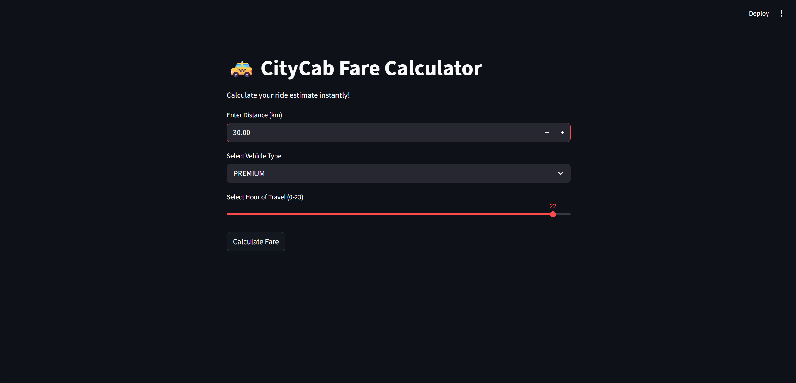
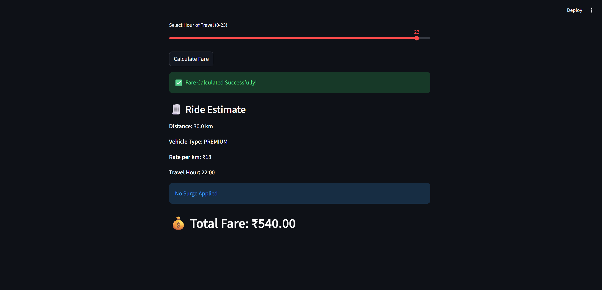

# CityCab Fare Calculator (Python Use Case)

## Business Case

CityCab is a ride-sharing startup that needs a reliable fare estimation backend.
The fare is dynamic and depends on:

- Distance traveled
- Vehicle type selected by the customer
- Time of day (surge pricing during peak hours)

This project provides a clean Python implementation of that logic, along with:

- A command-line interface for quick testing
- A Streamlit web UI for interactive usage

## Problem Statement

Build a script that calculates the final Ride Estimate based on:

- Distance in kilometers
- Vehicle type
- Surge pricing multiplier (applied during peak hours)

## Solution Overview

The fare calculation logic is centralized in the service layer.

Base formula:
Final Fare = Distance _ Vehicle Rate _ Surge Multiplier

### Vehicle Rates

- ECONOMY: 10 per km
- PREMIUM: 18 per km
- SUV: 25 per km

### Surge Pricing Rule

- Peak hours: 17:00 to 20:59 (hours 17, 18, 19, 20)
- Surge multiplier during peak: 1.5
- Otherwise: 1.0

## Project Structure

- app.py: Streamlit UI for fare calculation
- service.py: Core business logic and CLI entry point
- requirements.txt: Python dependencies
- **init**.py: Package marker file

## Core Function

File: service.py

calculate_fare(kilometers: float, vehicle_type: str, hour: int) -> tuple[float, float]

Returns:

- Final fare after surge
- Applied surge multiplier

Raises:

- ValueError when hour is outside 0-23
- VehicleTypeNotFoundException when vehicle type is invalid

## Prerequisites

- Python 3.10+
- pip

## Setup Instructions

1. Create a virtual environment:
   python -m venv env

2. Activate the environment (Windows):
   env\Scripts\activate

3. Install dependencies:
   pip install -r requirements.txt

## Run Options

### 1) Streamlit Web App

Run:
streamlit run app.py

What it does:

- Accepts distance, vehicle type, and travel hour
- Calculates fare using shared service logic
- Displays surge status and total fare

### 2) Command-Line App

Run:
python service.py

What it does:

- Prompts for ride inputs in terminal
- Prints a formatted ride estimate receipt

## Example Calculation

Input:

- Distance: 12 km
- Vehicle: PREMIUM
- Hour: 18

Calculation:

- Base fare = 12 \* 18 = 216
- Peak hour surge = 1.5
- Final fare = 216 \* 1.5 = 324

Output:

- Total Fare: 324.00
- Surge Applied: 1.5x

## Error Handling

The application validates key inputs:

- Invalid hour (less than 0 or greater than 23) -> ValueError
- Unsupported vehicle type -> VehicleTypeNotFoundException

In Streamlit, errors are shown with friendly UI messages.
In CLI mode, errors are printed in terminal.

## Notes for Developers

- Keep fare logic in service.py to avoid duplication.
- Add tests for calculate_fare before extending pricing rules.
- Future enhancements can include tax, discounts, and city-based rate cards.

## Screenshots

### App Home Screen

### Fare Result Screen

