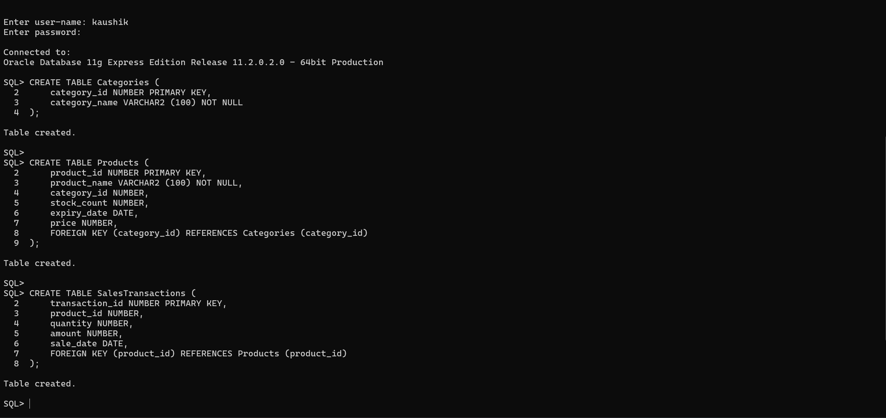
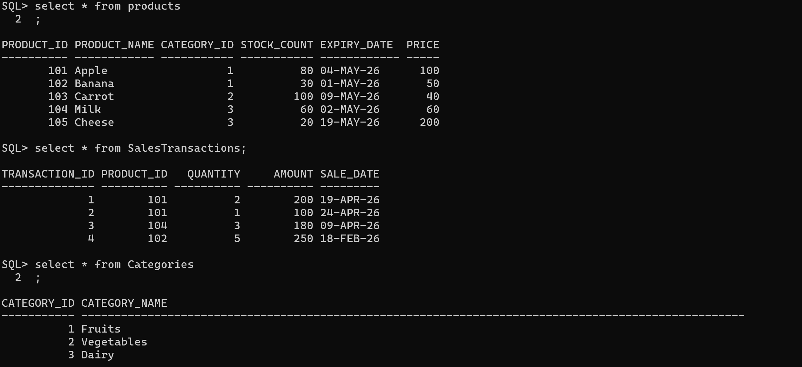
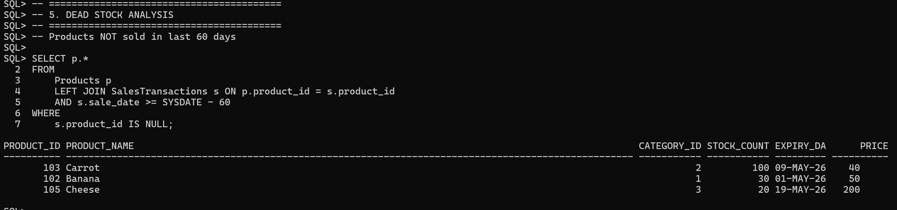
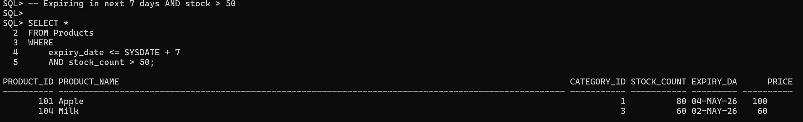
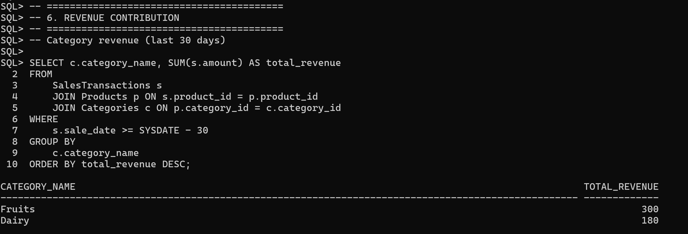

# Retail Insights — Data Analyst SQL Use Case

## Overview

This project contains a small retail dataset and a set of SQL scripts demonstrating common data-analyst tasks: inventory checks, dead-stock detection, expiry alerts, and revenue contribution analysis. It's designed for practicing SQL queries against an Oracle-compatible schema.

## Contents

- **creation_script.sql**: DDL to create the database schema (Categories, Products, SalesTransactions).
- **dummy_data_script.sql**: INSERT statements with sample data used by the analysis.
- **analysis_scripts.sql**: Example analytic queries (dead stock, expiring stock, revenue by category, etc.).
- **images/**: Screenshots showing sample query outputs.
- **readme.md**: This file.

## Schema Summary

Tables and key columns (see creation_script.sql for full DDL):

- Categories
  - category_id (NUMBER, PK)
  - category_name (VARCHAR2)
- Products
  - product_id (NUMBER, PK)
  - product_name (VARCHAR2)
  - category_id (NUMBER, FK -> Categories)
  - stock_count (NUMBER)
  - expiry_date (DATE)
  - price (NUMBER)
- SalesTransactions
  - transaction_id (NUMBER, PK)
  - product_id (NUMBER, FK -> Products)
  - quantity (NUMBER)
  - amount (NUMBER)
  - sale_date (DATE)

Notes: Dates in the sample scripts use Oracle's SYSDATE arithmetic for relative date filters (e.g., `SYSDATE - 60`).

## Example Queries (in analysis_scripts.sql)

- Dead stock (not sold in last 60 days):
  - LEFT JOIN `Products` to `SalesTransactions` and filter where recent transactions are NULL.
- Expiring soon with high stock (expiry within 7 days and `stock_count` > 50).
- Revenue contribution by category (last 30 days):
  - Join `SalesTransactions` -> `Products` -> `Categories`, sum `amount` grouped by category.

## Setup & Usage

1. Open an Oracle SQL client (e.g., SQL\*Plus) connected to your target schema/user.
2. Run the DDL to create tables:

```sql
@creation_script.sql
```

3. Load sample data:

```sql
@dummy_data_script.sql
```

4. Run the analysis queries to reproduce examples and see outputs:

```sql
@analysis_scripts.sql
```

Tip: Scripts assume Oracle date arithmetic (e.g., `SYSDATE - 30`). Adjust date functions if using a different RDBMS.

## Outputs & Screenshots

Sample outputs are included in the `images/` folder. Below are the key screenshots demonstrating the DDL and example query results.

- Creation of tables



- Dummy data loaded



- Dead stock analysis (products not sold in last 60 days)



- Expiring soon products (expiry within 7 days and high stock)



- Revenue contribution by category (last 30 days)



## Extending this project

- Add more transactions or products in `dummy_data_script.sql` to simulate seasonality.
- Create additional analysis scripts for cohort retention, product affinity (market-basket analysis), or inventory turnover metrics.
