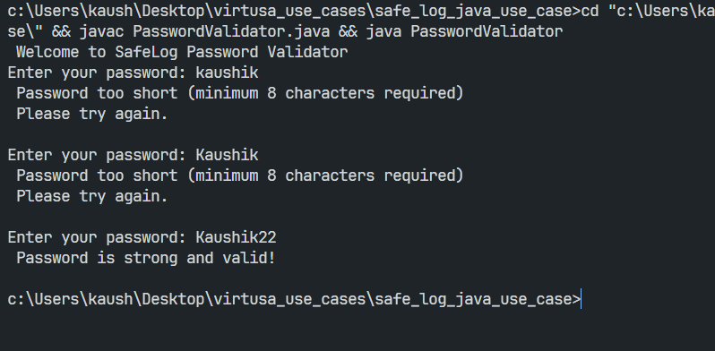

# SafeLog Password Validator

## Overview

SafeLog is a simple Core Java password validator for an employee portal use case. It demonstrates a modular approach to checking password strength and giving users specific feedback when a password does not meet policy requirements.

The validator currently enforces two rules:

- Minimum length of 8 characters
- At least one uppercase letter
- At least one digit

## Business Context

A cybersecurity-focused organization wants a safer password creation flow for its internal portal. Instead of relying on a single generic error message, the application tells users exactly what is missing so they can correct their password quickly.

## Problem Statement

Build a password strength checker that validates a string against corporate security policies and provides specific feedback on why a password failed.

## How It Works

The program prompts the user to enter a password and validates it using the `validatePassword` method in [PasswordValidator.java](PasswordValidator.java).

Validation flow:

1. Reject passwords shorter than 8 characters.
2. Scan each character to detect uppercase letters.
3. Scan each character to detect digits.
4. Print feedback for any missing rule.
5. Accept the password only when all required checks pass.

## Features

- Interactive command-line input
- Clear validation messages
- Simple retry loop until a valid password is entered
- Easy to extend with more policy checks such as lowercase letters, special characters, or banned words

## Project Structure

- [PasswordValidator.java](PasswordValidator.java) - Main Java program and validation logic
- [problem_statement.txt](problem_statement.txt) - Original use case description
- [images/image.png](images/image.png) - Reference image for the use case
- [PasswordValidator.class](PasswordValidator.class) - Compiled Java bytecode output

## Requirements

- Java Development Kit (JDK) installed
- Command-line access to javac and java

## How To Run

From the safe_log_java_use_case folder, compile and run the program:

```bash
javac PasswordValidator.java
java PasswordValidator
```

## Example Output

```text
Welcome to SafeLog Password Validator
Enter your password: test
Password too short (minimum 8 characters required)
Please try again.

Enter your password: Test1234
Password is strong and valid!
```

## Screenshot



## Notes

- The current implementation checks only length, uppercase letters, and digits.
- If you want a stricter corporate policy, extend the validator to require lowercase letters, special characters, or a maximum length.
